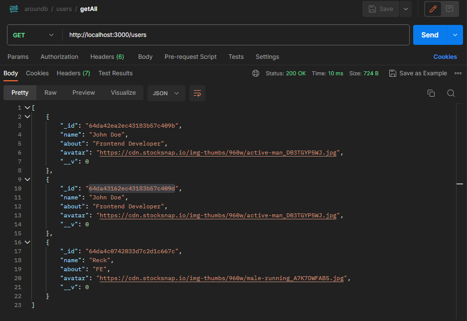
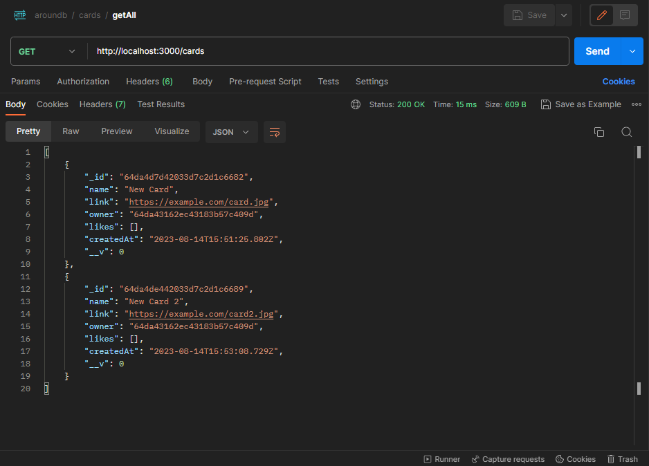

# Around Express ID

## Project Description
Around Express ID is a web application that allows users to share and explore photos taken at various locations. Users can  upload photos, view photos from other users, and interact with them through likes. The application is built using the Express.js framework for the backend and MongoDB for the database.

## Technologies Used
- Backend: Express.js
- Database: MongoDB
- Version Control: Git

## Features
- Upload and share photos .
- View photos uploaded by other users.
- Like photos and see the number of likes.

## Screenshots
- Users

- Cards

## Directories
- `/models`: Contains the MongoDB schema models.
- `/controllers`: Includes the backend logic and route handlers.
- `/routes`: Defines the API routes.
- `/public`: Stores static assets such as images.
- `app.js`: The main Express application file.

## How to Run the Project
1. Clone the repository: `git clone https://github.com/yourusername/around-express-id.git`
2. Navigate to the project directory: `cd around-express-id`
3. Install dependencies: `npm install`
4. Set up MongoDB connection in `app.js`.
5. Run the application: `npm start`
6. Open a web browser and go to `http://localhost:3000` to access the application.

## How to Contribute
1. Fork the repository.
2. Create a new branch: `git checkout -b feature-name`
3. Make changes and commit: `git commit -m "Add a new feature"`
4. Push to the branch: `git push origin feature-name`
5. Create a pull request.

## Author
- Name : Salman Dwi Maulana Akbar
- GitHub: [Salman Dwi Maulana Akbar](https://github.com/SalmanDMA)
